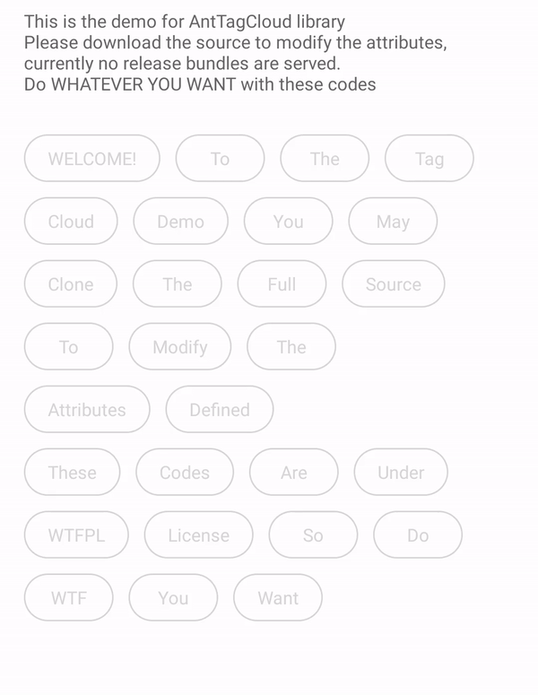

# Ant-CloudTag
Animated Cloud Tag for Android

> Currently, no release bundles are suppported, so download the full source code of "CloudTag", and modify&apply based on it.

## Demo


<table>

<tr>
<td>
Animation
</td>
<td>
Selectable  
</td>
</tr>

<tr>
</tr>
  
<tr>
<td>

</td>
<td>

</td>
</tr>

</table>

## Basic Usage

Add AntCloudTagView in your layout
```xml
<com.anttree.ant_cloud_tag.AntCloudTagView
    android:id="@+id/antListView"
    android:layout_width="match_parent"
    android:layout_height="wrap_content" />
```
Connect AntCloudTagBuilder with your view in controller
```java
new AntCloudTagBuilder(context, false)
	.setDefaultMaxLength(15)
	.setMaxSeletableNumber(3)
	.setMaxColumn(10)
	.expanded(true)
	.sizingPolicy(AntCloudTagBuilder.SIZING_WITH_FONT_CONFIGURATION)
	.setAnimatedChange(true)
	.initialize(getList())
	.with(findViewById(R.id.antListView))
	.setOnItemCheckChangeListener(this::onDataChanged);
```

### Row length

AntCloudTag will determine the column based on text length, so you should manage the max length for each row.

```java
//Set default row max length into 15 letters
.setDefaultMaxLength(15)
```

### Column numbers

For each row, maximum number of columns can be limited using ```setMaxCloumn```

```java
//Number of columns cannot exceeds 10
.setMaxColumn(10)
```

### Selectables

Number of maximum selections can be limited using ```setMaxSeletableNumber```

```java
//Limit the selections into 3
.setMaxSeletableNumber(3)
```


